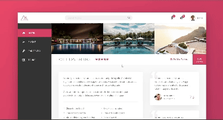

# Several Pure CSS Projects Just To Practice

This repository contains various projects that I created in order to practice and improve CSS skills. Each project focuses on different aspects of CSS, such as layout, responsiveness, animations, and more.

## [Natours 🏞️](https://natours-dev-demo.netlify.app)️

Natours is a project focused on creating a visually stunning and responsive website for a fictional outdoor tour company. It showcases advanced CSS techniques, including animations, gradients, and responsive design. Built using custom grid and floats with 7-1 architecture.

- Hero Section: A full-screen background with a gradient overlay and animated text.
- Features Section: Highlighting the benefits of the tours using icons and cards.
- Tours Section: Interactive cards with hover effects and 3D transformations.
- Stories Section: A video background and customer testimonials.
- Booking Form: A styled form with custom radio buttons and labels.
- Popup: A modal window with images and text, triggered by a button.

<kbd>

</kbd>
<kbd>

</kbd>

## [Trillo 🏨](https://trillo-dev-demo.netlify.app)

Trillo is a project designed as a booking platform for hotels. It emphasizes Flexbox for layout and responsive design.

- Header: A navigation bar with user icons and a search bar.
- Sidebar: A vertical navigation menu with hover effects.
- Gallery: A photo gallery showcasing hotel images.
- Overview Section: Displays hotel details, ratings, and location.
- Details Section: Includes a list of amenities and user reviews.
- Call-to-Action: A booking section with interactive buttons.

<kbd>

</kbd>
<kbd>

</kbd>

## [Nexter 🏡](https://nexter-dev-demo.netlify.app)

Nexter is a real estate website that demonstrates the use of CSS Grid for complex layouts.

- Header: A logo, tagline, and a "Seen On" section with partner logos.
- Realtors Section: Highlights top realtors with images and details.
- Features Section: Lists the benefits of the properties using icons and text.
- Homes Section: A grid-based layout showcasing property cards with images, details, and prices.
- Gallery Section: A responsive photo gallery using CSS Grid.
- Footer: A navigation menu and copyright information.

<kbd>

</kbd>
<kbd>

</kbd>
